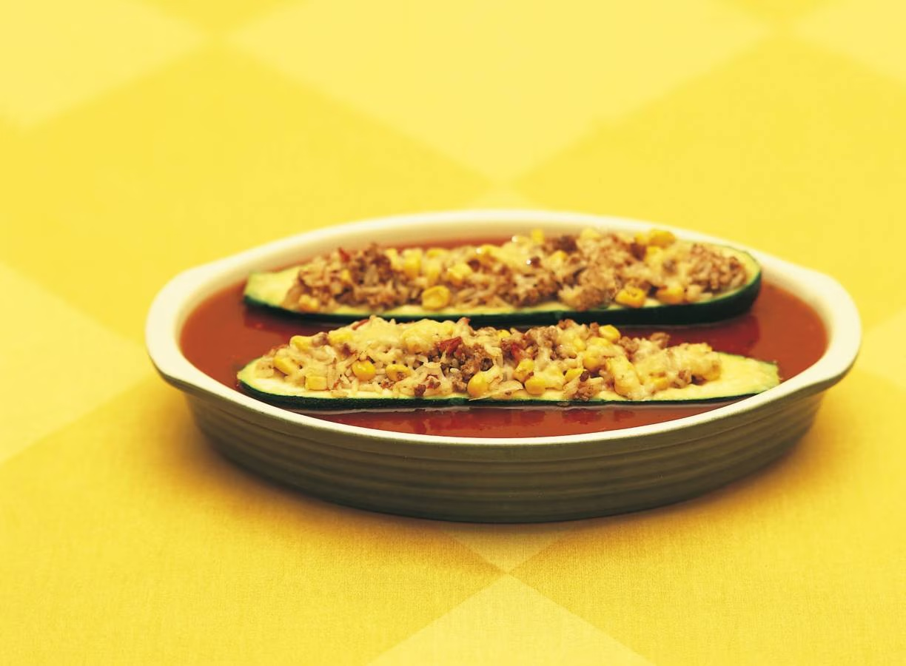

# LoRA training (Low-Rank Adaptation) of Stable Diffusion and Flux

Repository is meant to experiment with getting stable diffusion and Flux to do image style transfer.

The case at hand is trying to get 'old' style images to be converted into 'new' style images.

- 'Old' style images here: [./images-old/](./images-old/)
- 'New' style images here: [./images-new/](./images-new/)

As one can see - 'new' style is top-down, more light, vibrant colors and slightly over-exposed.

Trained on my local RTX4090 GPU. 

## Findings with Stable Diffusion 1.5

- Script can be found here: [./diffusion_lora/diffusion_lora.ipynb](./diffusion_lora/diffusion_lora.ipynb)
- Results: [./work/outputs/](./work/outputs/)

## Findings with Flux

- Script can be found here: [./flux_lora/train_control_lora_flux.py](./flux_lora/train_control_lora_flux.py) which I fully took from: [https://github.com/huggingface/diffusers/tree/main/examples/flux-control](https://github.com/huggingface/diffusers/tree/main/examples/flux-control)
- Results: [./flux_lora/](./flux_lora/courgettebroodjes.png)

## Side-by-side
Old style | Stable Diffusion | Flux
:---:|:---:|:---:
 |  | 

### Some learnings

Running inside DevContainer gave me lots of headaches.
- First off: perf - especially IO perf - is an issue. Huggingface models are big, if you pull those down - it's significantly slower on Windows>WSL2>DevContainer then straight onto Windows.
- Second: lots of GPU strange things. Out-of-Memory CUDA things. On windows as well, but a lot more in the Linux container. 
- Use Python 3.12 or 3.11 - some depenedencies didn't like the v3.13.
